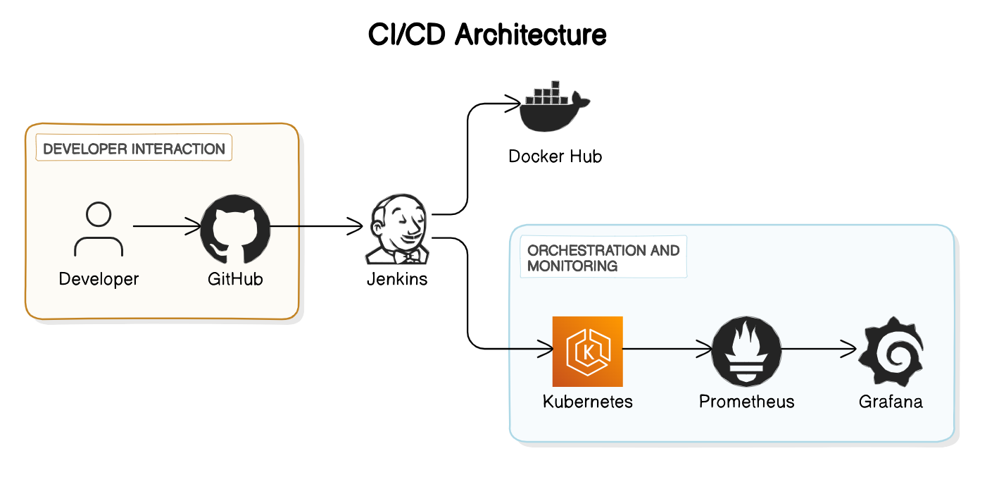
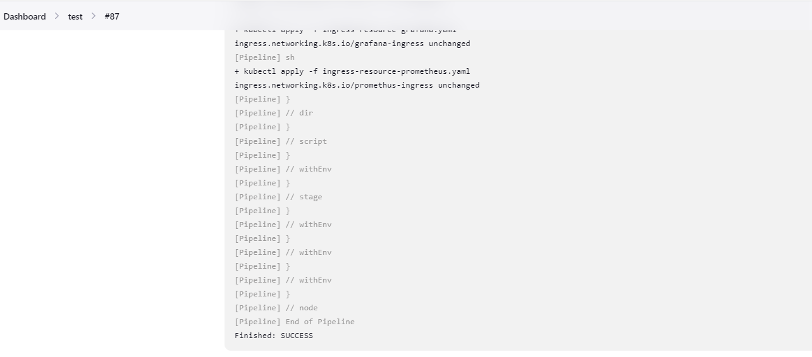

http-echo complete CI-CD
=========
HTTP Echo is a small go web server that serves the contents it was started with
as an HTML page.

The default port is 5678, but this is configurable via the `-listen` flag:

```
http-echo -listen=:8080 -text="hello world"
```

Then visit http://localhost:8080/ in your browser.

# CI-CD PIPELINE FOR THE GO-APP


## Architecture Diagram



The above diagram illustrates the architecture of the CI/CD pipeline for deploying the application.


## Pre-requisites

Before you begin, ensure you have the following prerequisites:

- **AWS Account**: You need an AWS account with appropriate permissions to manage resources.
- **Kubernetes Cluster**: Set up a Kubernetes cluster using tools like Kops or EKS.
- **Docker**: Install Docker to build and push Docker images.
- **Helm**: Install Helm to manage Kubernetes applications.
- **Cert-Manager**: Install Cert-Manager to manage TLS certificates in Kubernetes.
- **Route53 Access**: Ensure you have access to manage Route53 resources in AWS.

## Technologies Used

This project uses the following technologies:

- **Kubernetes (K8s)**: Container orchestration platform.
- **Docker**: Containerization platform for building and managing containers.
- **Helm**: Kubernetes package manager for deploying and managing applications.
- **Cert-Manager**: Kubernetes add-on to automate management and issuance of TLS certificates.
- **Route53**: AWS DNS web service for routing traffic to resources.

## ci-cd stages/workflow

1. **Build Application**: Build your GoLang application using `go build` command.
2. **Build Docker Image**: Build a Docker image containing your application using `docker build` command.
3. **Push Docker Image**: Push the Docker image to a container registry such as Docker Hub or AWS ECR using `docker push` command.
4. **Deploy Application**: Deploy your application to Kubernetes cluster using Helm. Use `helm install` or `helm upgrade` commands to manage the deployment.
5. **Expose Services**: Expose your services using an Ingress controller. Apply the Ingress resources using `kubectl apply` command.
6. **Secure Ingress**: Secure your Ingress using Cert-Manager. Apply the necessary resources such as namespaces, secrets, issuers, and certificates using `kubectl apply` command.
7. **Verify Deployment**: Verify that your application is deployed successfully by accessing the exposed URL or endpoint.


## Steps

## Steps

To deploy this app, follow the steps:

1. **Clone the Repository**: Clone the repository to your local machine using the following command:
    ```bash
    git clone https://github.com/Afeez-AA/http-echo.git
    ```

2. **Install Jenkins and Configure Plugins**: Install Jenkins on your server and configure the required plugins for your CI/CD pipeline.

3. **Install Kubernetes Cluster**: Install your Kubernetes cluster. You can use tools like Kops for installation. Refer to [Kops Installation Guide](https://kubernetes.io/docs/setup/production-environment/tools/kops/) for detailed instructions.

4. **Install Helm**: Install Helm on your Kubernetes cluster. Refer to the official [Helm Documentation](https://helm.sh/docs/intro/install/) for installation instructions.

5. **Configure Jenkins Pipeline**: Configure Jenkins to run the pipeline whenever code is pushed to the repository. Set up webhooks or polling triggers as per your preference.

6. **Cleanup Resources**: After deployment, ensure to clean up any unused resources to avoid unnecessary costs and resource consumption.

### Validation URLs

- Grafana URL: [grafana.afeezadeboye.site](http://grafana.afeezadeboye.site)
- Prometheus URL: [prometheus.afeezadeboye.site](http://prometheus.afeezadeboye.site)
- HTTP-Echo App URL: [webapp.afeezadeboye.site](http://webapp.afeezadeboye.site)


## Conclusion

Successful build after the 87 trials! 🎉🚀




